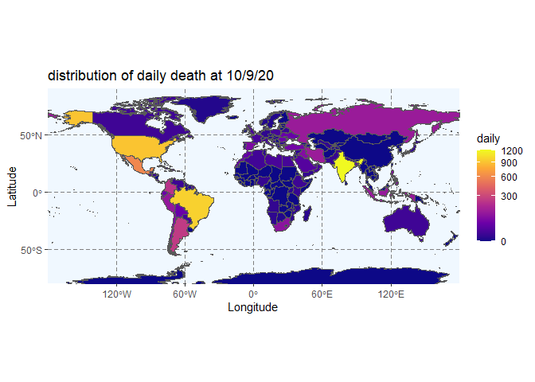
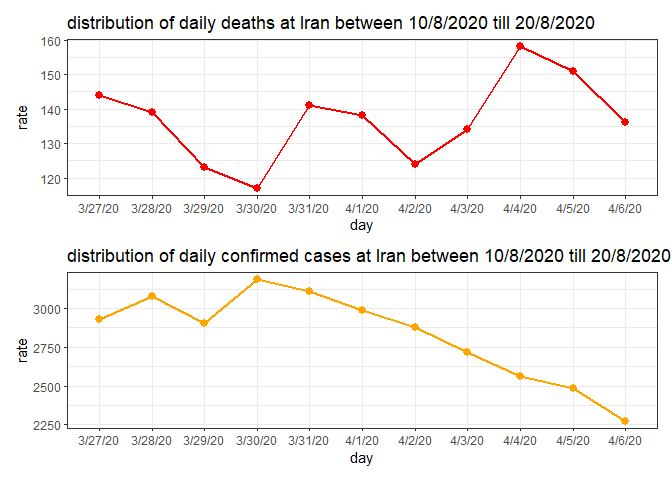

# hesaba.covid

<!-- badges: start -->

[](https://www.tidyverse.org/lifecycle/#stable)
<!-- badges: end -->

Hesaba.covid is developed to maintain data and plot some indexes of
corona to have a better measure of its situation and evolution

## Installation

source is available at
[GitHub](https://github.com/smehdim/hesaba.corona) with:

``` r
# install.packages("devtools")
devtools::install_github("smehdim/hesaba.covid")
```

## Examples

you can get updated tidy data  using ‘updating\_data’:

    ## # A tibble: 190 x 6
    ##    Country_Region      Last_Update         Confirmed Deaths Active Recovered
    ##    <chr>               <chr>                   <int>  <dbl>  <int>     <int>
    ##  1 Afghanistan         2020-10-29 04:24:49     41145   1529   5379     34237
    ##  2 Albania             2020-10-29 04:24:49     20040    493   8654     10893
    ##  3 Algeria             2020-10-29 04:24:49     57026   1941  15450     39635
    ##  4 Andorra             2020-10-29 04:24:49      4517     72   1301      3144
    ##  5 Angola              2020-10-29 04:24:49     10074    275   6106      3693
    ##  6 Antigua and Barbuda 2020-10-29 04:24:49       124      3      6       115
    ##  7 Argentina           2020-10-29 04:24:49   1130533  30071 169315    931147
    ##  8 Armenia             2020-10-29 04:24:49     82651   1243  28900     52508
    ##  9 Australia           2020-10-29 04:24:49     27565    907   1427     25231
    ## 10 Austria             2020-10-29 04:24:49     89496   1027  26785     61684
    ## # ... with 180 more rows

another provided function is plot\_on\_earth which shows us distribution
around the world. below one is at 10/09/20 and about death:

<!-- -->

third and last provided function is for plotting time series of corona
indicators: <!-- -->
